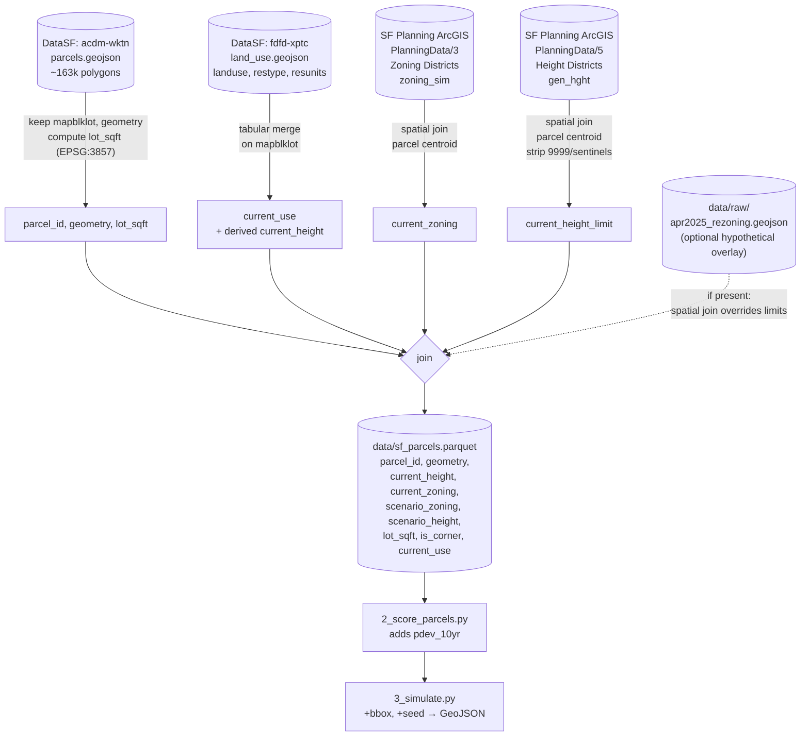

# How ZoningViz works

This is the "explain it like I'm a planner" version. If you just want to run it, see the [README](README.md).

## Glossary

A handful of terms do almost all the work in this project. If you understand these six, the rest follows.

- **Parcel (lot).** One piece of land with one owner, one address, one entry on the assessor's roll. Every building sits on exactly one parcel. In San Francisco each parcel has a stable ID called a `mapblklot`.
- **Zoning.** The city's rulebook for what you can build on a given parcel — mostly *what use* (housing, shops, offices) and *how big* (height limit, floor area ratio, lot coverage).
- **Height limit.** The maximum height, in feet, a new building on a parcel is allowed to be. Often the single most consequential number in a zoning code.
- **Upzoning.** Changing the rules to allow more or bigger buildings on a parcel than were allowed before. The opposite is *downzoning*.
- **Redevelopment probability (pdev).** Our estimate of the chance that a given parcel gets torn down and rebuilt in some time window — say, the next 10 years. Higher for underused lots in hot neighborhoods with big upzones; lower for lots that already have new buildings on them.
- **Simulation.** Running the redevelopment dice-roll for every parcel, every year, to produce one possible future. Run it again with a different random seed and you get a slightly different future. That spread is the answer to "what could happen."

## The pipeline

Three scripts, in order. Each one reads what the previous one wrote.

### 1. `1_fetch_data.py` — assemble the inputs

Downloads four public datasets and joins them on parcel ID:

- **Parcel geometries** (DataSF) — the actual polygon shape of every lot in the city.
- **Land use** (DataSF) — what's currently on each lot (residential/commercial/vacant) and a rough proxy for how tall the existing building is.
- **Zoning districts** (SF Planning ArcGIS) — the zoning code that applies today.
- **Height districts** (SF Planning ArcGIS) — the maximum height a new building is allowed to be.

For San Francisco the height/zoning layers already reflect the **Family Zoning Plan** that was signed into law in December 2025 — they're snapshotted from the live `PlanningData` MapServer, which SF Planning updated in February 2026 to match the adopted ordinance. There's no separate "before/after" overlay needed; the "after" *is* the live data. If you want to layer an additional hypothetical on top (a more aggressive proposal, a downzoning, a what-if), drop it in as `data/raw/apr2025_rezoning.geojson` and the script will spatially join it on top of the live limits.

The output is a single file: `data/sf_parcels.parquet`. One row per parcel, with columns for geometry, current built height, current zoning code, scenario zoning, scenario height limit (= current limit unless an overlay was supplied), and basic lot attributes (size, corner-or-not, current use).

This file is the only thing the rest of the pipeline reads. If you commit it to the repo, anyone can run steps 2 and 3 without ever touching the raw data sources.

Two things worth noting in the diagram that the prose glosses over: **land use is a tabular merge on `mapblklot`** — no spatial work needed because DataSF keys it by parcel ID. The other three layers are spatial joins by parcel centroid. And the **rezoning overlay is the dotted edge**: optional, only relevant if you want to model a *further* hypothetical on top of today's adopted zoning.

### 2. `2_score_parcels.py` — assign redevelopment probabilities

For each parcel, compute a `pdev_10yr` — our estimate of the probability it redevelops in the next decade.

The first version uses a simple, transparent heuristic:

- Compute an **upzone ratio**: how much more building is allowed under the new rules versus what's there today.
- Multiply by lot size (bigger lots are more attractive to developers).
- Zero out parcels that obviously won't redevelop: parks, schools, churches, recently-built housing, historic landmarks.
- Calibrate the constant so the citywide total over 10 years matches the rate of redevelopment SF has actually seen historically (a few thousand units per year).

This is not a sophisticated model. It is *legible* — you can read 30 lines of Python and know exactly what's driving the numbers. The README is honest about that, and a future version can swap in a real logistic regression trained on building permits without changing anything downstream.

The output is the same parquet file, with a `pdev_10yr` column added.

### 3. `3_simulate.py` — roll the dice and write GeoJSON

For each parcel in the requested bounding box:

- Convert the 10-year probability to an annual rate.
- For each year from 1 to N, draw a random number. If it's below the annual rate, mark the parcel as developed in that year and stop rolling for it.
- Pick a realized height somewhere between 70% and 100% of the allowed limit (real buildings rarely hit the cap exactly).

Write the result as a GeoJSON FeatureCollection where each feature is a parcel polygon with `height_feet` and `year_built` properties. 3DStreet reads this and extrudes the polygons into 3D blocks.

A `--seed` flag makes runs reproducible. Running with three different seeds and comparing the pictures is a good way to build intuition for how much of what you're seeing is the model versus the dice.

## Known simplifications

Things the current pipeline deliberately does *not* model, documented up front so they don't surprise you:

- **Flat ground (z = 0).** Every building is extruded upward from sea level. On flat parts of the city this looks fine; on hills (Duboce Triangle, Noe Valley, anywhere with real SF topography) buildings on a hilltop and buildings in a valley start at the same elevation, which is wrong. Relative *heights* between buildings are still correct — only the *base elevations* are missing. A future version will sample a digital elevation model (DEM) at each parcel centroid and store a `base_elevation_m` column in the parquet; the viewer can then offset each building accordingly. Until then, treat the 3D pictures as "massing on a flat plane."
- **Height is above grade, not above sea level.** The `current_height` and `scenario_height` columns mean "feet above the ground at that parcel," matching how SF Planning's `ex_height2024` is defined. If you swap in a different height source for another city, check what its zero point is — LiDAR-derived heights, OSM `building:height`, and assessor data all use slightly different conventions.
- **Flat building bases.** Even with terrain elevation added, each building's footprint is treated as a flat slab. Real buildings on slopes have stepped or sunken foundations; we don't model that.

## Where this could be wrong

Worth being explicit about, because it shapes how you should interpret the pictures:

- **The pdev model is a heuristic, not a forecast.** It captures "which parcels are most attractive to redevelop" reasonably well and "exactly how many will get built" poorly. Treat the *spatial pattern* as more reliable than the *count*.
- **Realized height is a uniform random draw.** Real developers optimize for FAR, parking, financing, and neighbors — none of which we model. Buildings will be lumpier in reality.
- **No market feedback.** If the model says 200 buildings get built in a 10-block area, that would crater rents and slow the next round of building. We don't simulate that. For neighborhood-scale "what if" pictures this is fine; for citywide unit-count forecasts it isn't.
- **Static rules.** We model one zoning change at a time, against today's parcels. We don't try to predict what the city *will* do, only what would happen *if* a specific proposal passed.

The whole project is more useful as a tool for arguing about zoning concretely than as a tool for predicting unit counts precisely.