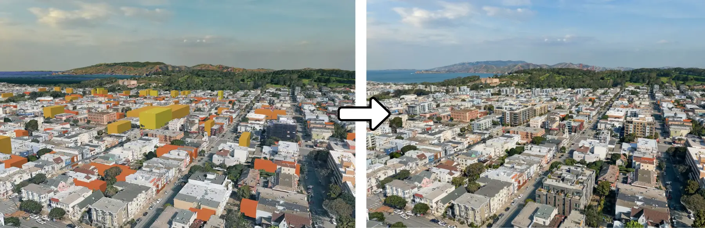

# ZoningViz

**See how zoning scenarios could reshape your neighborhood over the next 20 years.**

> **Status:** early work in progress. This methodology combines concepts from San Francisco's [rezoner](https://github.com/sdamerdji/rezoner) / [cityscaper](https://github.com/emunsing/cityscaper) / [FoglineSF Family Zoning Plan](https://github.com/FoglineSF/sf-family-zoning-plan) projects and attempts to add modularization to allow importing data from other locations, handle elevation, and export to 3DStreet for 3D map compositing and AI rendering.



*Placeholder image will show a 3D rendering of San Francisco's Duboce Triangle 20 years out.*

## What you're looking at

This picture is a 3D rendering of buildings generated from a model that explores what could be built in the next 20 years under the city's current zoning rules. SF's [Family Zoning Plan](https://sfplanning.org/sf-family-zoning-plan), signed into law December 2025, raised height limits along transit corridors and on commercial streets across the north and west sides of the city. This pipeline takes those rules at face value and asks: *if developers actually built to what's now allowed, what would the neighborhood look like?*

This is a scenario builder, not a forecast. It exists to make abstract zoning policy visible and discussable. Different assumptions produce different pictures, change the assumptions and see what happens.

## Try it

[future link to demo page]

## How it works, in plain English

1. **Start with the parcel data.** Download the shape of every parcel (lot) in the city from public data.
2. **Add the rules.** For each parcel, look up the current zoning, mainly the maximum height a new building can be.
3. **Score each parcel.** Some lots are much more likely to be redeveloped than others. A parking lot next to transit with a big gap between its current building and what the zoning now allows is a strong candidate; a recently-built apartment is not. Each parcel gets a probability.
4. **Roll the dice, year by year.** For each parcel, each year, check whether it gets redeveloped that year based on its probability. This produces a list of new buildings with heights and years.
5. **Show it in 3D.** Hand the result to [3DStreet](https://3dstreet.app), which extrudes the buildings superimposed on real world maps to generate realistic visuals.

For depth on each step, including the assumptions and where they could be wrong, see [HOW_IT_WORKS.md](HOW_IT_WORKS.md).

## Run it yourself

```bash
git clone https://github.com/YOUR-USER/zoningviz
cd zoningviz
python -m venv venv && source venv/bin/activate
pip install -r requirements.txt

# Three steps, in order. --jurisdiction defaults to sf; --scenario defaults to current.
python scripts/1_fetch_data.py                              # fetch + normalize parcels
python scripts/2_score_parcels.py                           # add redevelopment probabilities
python scripts/3_simulate.py \
    --years 20 \
    --bbox -122.4377,37.7604,-122.4245,37.7710 \
    --out examples/duboce.geojson
```

The third script prints a 3DStreet share URL on stdout. Pipe it to `pbcopy` (macOS) or `xargs open` and the rendering opens in your browser.

## Try a different scenario

Scenarios are Python modules in `scenarios/`. `current` is the default (live zoning as-is). To try a silly demo that adds 500 ft to every parcel fronting Market Street:

```bash
python scripts/2_score_parcels.py --scenario market_street_plus_500
python scripts/3_simulate.py --scenario market_street_plus_500 \
    --years 20 --bbox -122.420,37.770,-122.405,37.785 \
    --out examples/market_st.geojson
```

Add your own scenario by dropping a new `scenarios/my_scenario.py` with an `apply(parcels)` function. No script changes needed.

## Use it for another city

Jurisdictions are Python modules in `jurisdictions/`. `sf` is the only working adapter today; `dc` is a stub with a checklist of datasets to wire up. To adapt the pipeline to a new city, write a `jurisdictions/<name>.py` exposing a `fetch()` function that returns a GeoDataFrame in the standard parcel schema. See [REPLICATE_FOR_YOUR_CITY.md](REPLICATE_FOR_YOUR_CITY.md) for the recipe.

## License

MIT
